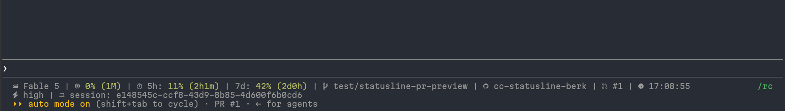

# cc-statusline-berk

[](https://www.npmjs.com/package/cc-statusline-berk)
[](https://opensource.org/licenses/MIT)

This is the status line I use in Claude Code. Setup steps are below, and what each item shows is explained further down. The project name and PR number are clickable links to GitHub, which I find really handy.



## Setup

Requires [Bun](https://bun.sh/) >= 1.2.0.

Install:

```bash
npm install -g cc-statusline-berk
# or
bun install -g cc-statusline-berk
```

Add to `~/.claude/settings.json`:

```json
{
  "statusLine": {
    "type": "command",
    "command": "cc-statusline-berk"
  }
}
```

Restart Claude Code.

### From source

```bash
git clone https://github.com/berk-karaal/cc-statusline-berk.git
cd cc-statusline-berk
just install
just build
```

Then point `command` at the built file:

```json
{
  "statusLine": {
    "type": "command",
    "command": "/absolute/path/to/cc-statusline-berk/dist/cc-statusline-berk.js"
  }
}
```

## What it shows

Left to right:

1. **Model** — e.g. "Opus", "Sonnet", "Haiku"
2. **Context usage** — percentage of the context window used, with window size (e.g. "12% (1M)")
3. **Rate limits** — 5-hour and 7-day usage percentages with reset countdowns
4. **Git branch**
5. **Project** — project name, linked to the GitHub repo when a remote exists
6. **Pull request** — PR number, linked, when one exists for the current branch (needs the `gh` CLI, logged in)
7. **Time** — local time, 24-hour format

Items are laid out across up to three lines; when the terminal is narrow, lower-priority items are dropped.

No configuration. Git info is detected from the current directory.

Links use [OSC 8](https://gist.github.com/egmontkob/eb114294efbcd5adb1944c9f3cb5feda) terminal hyperlinks, supported by most modern terminals (iTerm2, Windows Terminal, GNOME Terminal 3.26+, VS Code). Icons are Nerd Font glyphs, so a Nerd Font-patched terminal font is needed.

## Contributing

See [CONTRIBUTING.md](CONTRIBUTING.md).

## License

[MIT](LICENSE) © Berk Karaal
